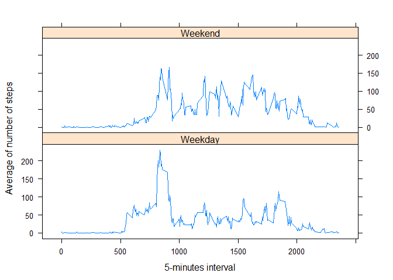

#**Reproducible Research - Peer Assigment 1**

##**Introduction:**

It is now possible to collect a large amount of data about personal movement using activity monitoring devices such as a [Fitbit](http://www.fitbit.com/), [Nike Fuelband](http://www.nike.com/us/en_us/c/nikeplus-fuelband), or [Jawbone Up](https://jawbone.com/up). These type of devices are part of the "quantified self" movement - a group of enthusiasts who take measurements about themselves regularly to improve their health, to find patterns in their behaviour, or because they are tech geeks. But these data remain under-utilized both because the raw data are hard to obtain and there is a lack of statistical methods and software for processing and interpreting the data.

This assignment makes use of data from a personal activity monitoring device. This device collects data at 5 minute intervals throughout the day. The data consists of two months of data from an anonymous individual collected during the months of October and November, 2012 and include the number of steps taken in 5 minute intervals each day.


##**Data:**

The data for this assignment can be downloaded from the course web site:

* **Dataset**: [Activity monitoring data](https://d396qusza40orc.cloudfront.net/repdata%2Fdata%2Factivity.zip) [52K]

The variables included in this dataset are:

*	**steps**: Number of steps taking in a 5-minute interval (missing values are coded as NA)
*	**date**: The date on which the measurement was taken in YYYY-MM-DD format
*	**interval**: Identifier for the 5-minute interval in which measurement was taken

The dataset is stored in a comma-separated-value (CSV) file and there are a total of 17,568 observations in this dataset.

##**Assignment**


###**Loading and pre-processing the data**

__*1.  Load the data (i.e. <span style="color:red">```read.csv()```</span>)*__


```r
activity<-read.csv("activity.csv", colClasses=c("numeric", "character", "numeric"))
```

__*2.  Process/transform the data (if necessary) into a format suitable for your analysis*__

We need to convert the fiels

- **date** into Date class. 
- **interval** into Factor class.


```r
activity$date <- as.Date(activity$date, format = "%Y-%m-%d")
#activity$interval <- as.factor(activity$interval)
summary(activity)
```

```
##      steps             date               interval     
##  Min.   :  0.00   Min.   :2012-10-01   Min.   :   0.0  
##  1st Qu.:  0.00   1st Qu.:2012-10-16   1st Qu.: 588.8  
##  Median :  0.00   Median :2012-10-31   Median :1177.5  
##  Mean   : 37.38   Mean   :2012-10-31   Mean   :1177.5  
##  3rd Qu.: 12.00   3rd Qu.:2012-11-15   3rd Qu.:1766.2  
##  Max.   :806.00   Max.   :2012-11-30   Max.   :2355.0  
##  NA's   :2304
```

###**What is mean total number of steps taken per day?**

For this part of the assignment, we can ignore the missing values in the dataset.


__*1.  Calculate the total number of steps taken per day*__


```r
stepbyday<-aggregate(steps ~ date, data=activity ,sum,na.rm = TRUE)
head(stepbyday)
```

```
##         date steps
## 1 2012-10-02   126
## 2 2012-10-03 11352
## 3 2012-10-04 12116
## 4 2012-10-05 13294
## 5 2012-10-06 15420
## 6 2012-10-07 11015
```

__*2. Make a histogram of the total number of steps taken each day*__


```r
library(ggplot2)
ggplot(stepbyday, aes(x=steps))+
        geom_histogram(colour = "black", fill = "darkred", binwidth = 1000)+
        labs(title="Histogram of the total number of steps taken each days",
             x="Number of Steps in a day", y="Frequency")+
        theme_bw() 
```

 

__*3.  Calculate and report the mean and median of the total number of steps taken per day*__


```r
ac_mean<-mean(stepbyday$steps)
ac_median<-median(stepbyday$steps)
```

The mean is **10766.19** and the median is **10765**

###**What is the average daily activity pattern?**

__*1.  Make a time series plot (i.e. <span style="color:red">```type = "l")```</span> ) of the 5-minute interval (x-axis) and the average number of steps taken, averaged across all days (y-axis)*__


```r
stepbyinterval <- aggregate(steps~interval, data=activity, FUN=mean, na.rm=TRUE)
plot(x = stepbyinterval$interval, y = stepbyinterval$steps, type = "l", xlab = "5-minutes interval",ylab = "average number of steps")
```

 

__*2.  Which 5-minute interval, on average across all the days in the dataset, contains the maximum number of steps?*__


```r
maxint<-stepbyinterval[which.max(  
        stepbyinterval$steps),]
```
The interval **835** has the maximum number of steps on average (**206.17**)

###**Imputing missing values**

__*1.  Calculate and report the total number of missing values in the dataset (i.e. the total number of rows with <span style="color:red">```NA```</span>s)*__


```r
missvalues<-sum(is.na(activity$steps))
```

The total number of missing values in the dataset is **2304**

__*2.  Devise a strategy for filling in all of the missing values in the dataset. The strategy does not need to be sophisticated. For example, you could use the mean/median for that day, or the mean for that 5-minute interval, etc.*__

My strategy is use "stepbyinterval" generated in point 1 of the previous exercise (*What is the average daily activity pattern?*). it is calculating the mean for that 5-minute interval.

__*3.  Create a new dataset that is equal to the original dataset but with the missing data filled in.*__


```r
activityfull<-activity ## copy the information from activity
findint<-numeric
for (i in 1:nrow(activityfull)) ## For all the row
{
    if (is.na(activityfull[i,1])) ## if step is NA
    {
        findint <- activityfull[i,3] ## Save the interval
        activityfull[i,1]<-subset(stepbyinterval$steps,stepbyinterval$interval == findint) ## add the mean using "stepbyinterval" function (created before) for this interval
    }
}
```

Now activityfull has **0** rows with NA

__*4.  Make a histogram of the total number of steps taken each day and Calculate and report the mean and median total number of steps taken per day. Do these values differ from the estimates from the first part of the assignment? What is the impact of imputing missing data on the estimates of the total daily number of steps?*__


```r
stepbyinterval2 <- aggregate(steps~date, data=activityfull, FUN=sum)
hist(stepbyinterval2$steps, main = "Histogram of the total number of steps taken each day",xlab = "5-minutes interval")
```

 

```r
acfull_mean<-mean(stepbyinterval2$steps)
acfull_median<-median(stepbyinterval2$steps)
```

The new mean is **10766.19** and the median is **10766.19**. Imputing the missing data impact to the median not to the mean.

###**Are there differences in activity patterns between weekdays and weekends?**

*For this part the <span style="color:red">```weekdays()```</span> function may be of some help here. Use the dataset with the filled-in missing values for this part.*

__*1.  Create a new factor variable in the dataset with two levels - "weekday" and "weekend" indicating whether a given date is a weekday or weekend day*__


```r
week <- weekdays(activityfull$date)
week_day <- week
for (i in 1:nrow(activityfull))
{
    if (week[i]== "Saturday"||week[i]== "Sunday")
    {
        week_day[i]<- 'Weekend'
    }else{
        week_day[i]<- 'Weekday'
    }
}
activityfull$weekdate<-factor(week_day)
summary(activityfull$weekdate)
```

```
## Weekday Weekend 
##   12960    4608
```

__*2.	Make a panel plot containing a time series plot (i.e. <span style="color:red">```type = "l"```</span>) of the 5-minute interval (x-axis) and the average number of steps taken, averaged across all weekday days or weekend days (y-axis). *__


```r
stepbydayweek<-aggregate(steps ~ interval + weekdate, data=activityfull ,mean)
library(lattice)
xyplot(steps ~ interval | weekdate, stepbydayweek, type = "l", layout = c(1, 2), 
    xlab = "5-minutes interval", ylab = "Average of number of steps")
```

 

